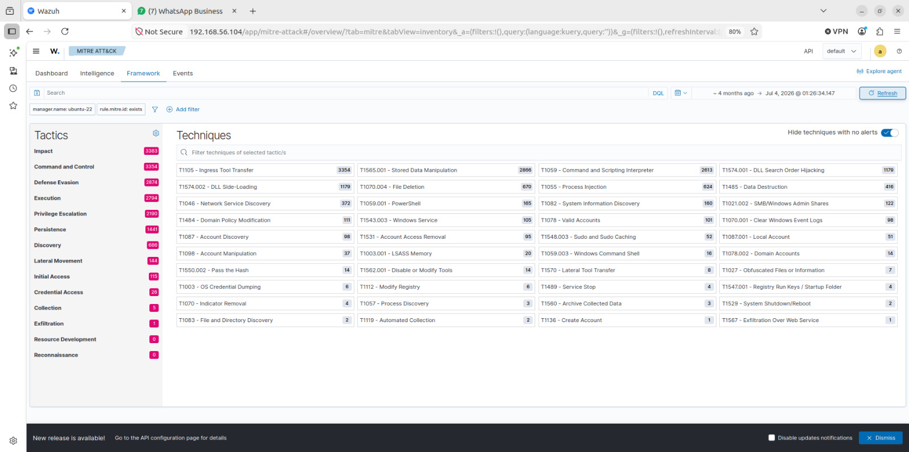
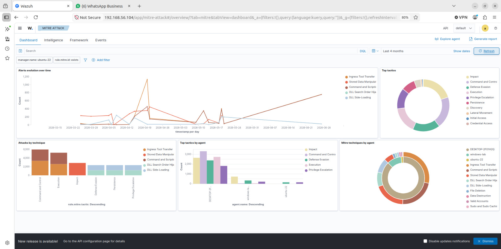
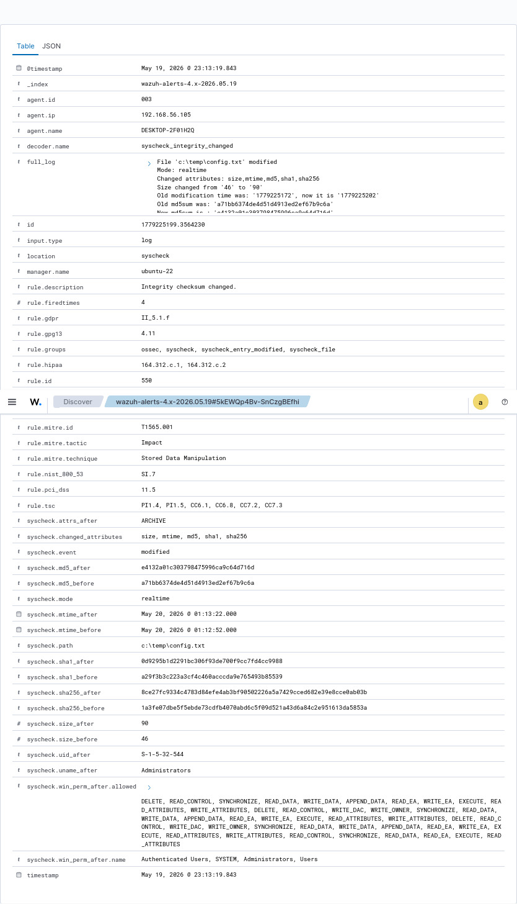

# 🛡️ Wazuh SOC Home Lab — Threat Detection & Attack Simulation

<div align="center">


**MS Cybersecurity Major Project | SRH Berlin University of Applied Sciences**

A production-grade Security Operations Center (SOC) home lab built to simulate, detect, and respond to real-world cyber attacks using Wazuh SIEM/XDR, Sysmon, and the MITRE ATT&CK framework.

*Built incrementally over 4 months (March–July 2026) as a solo project.*

[📊 Real Results](#-real-lab-results) · [⚔️ Attacks](#️-10-attack-simulations) · [🗺️ MITRE Coverage](#️-mitre-attck-coverage) · [📋 Custom Rules](#-custom-detection-rules) · [⚠️ Limitations](#️-known-limitations--future-work)

</div>

---

## 📊 Real Lab Results

| Metric | Value |
|--------|-------|
| Total MITRE-Mapped Alerts | **10,345** |
| Critical Level 12+ Alerts | **50** |
| True-Positive Detection Rate | **10/10 — 100%** |
| Windows Agents Monitored | **2** |
| Custom Detection Rules | **13** |
| Sigma Rules | **5** |
| MITRE Tactics (10 attacks) | **8** |
| MITRE Tactics (4-month dataset) | **14** |
| MITRE Techniques Detected | **30+** |
| Average MTTD | **< 30 seconds** |
| Peak Alerts (Single Day) | **1,500+** |

> **Note on detection rate:** The 100% figure is a true-positive rate across 10 controlled attack simulations — all 10 attacks were detected when executed. False-positive rate was not formally measured in this lab environment. In production, all rules would require a 30-day baseline period before enabling alerting.

> **Note on tactic count:** The 14-tactic figure reflects aggregate MITRE ATT&CK coverage across the full 4-month dataset (10,345 alerts) visible in the Wazuh MITRE ATT&CK Framework view. The 10 attack simulations directly cover 8 core tactics.

---

## 🏗️ Lab Architecture

```
┌─────────────────────────────────────────────────────────┐
│                   HOST MACHINE (16GB RAM)               │
│                                                         │
│  ┌─────────────────────┐   ┌─────────────────────────┐ │
│  │  Ubuntu 22.04 VM    │   │    Windows 10 VM        │ │
│  │  4GB RAM            │   │    4GB RAM              │ │
│  │  Wazuh Manager      │   │    Sysmon + Wazuh Agent │ │
│  │  Wazuh Indexer      │   │    192.168.56.105       │ │
│  │  Wazuh Dashboard    │   └─────────────────────────┘ │
│  │  192.168.56.104     │                               │
│  └─────────────────────┘                               │
│  ┌─────────────────────┐                               │
│  │  Kali Linux VM      │  ← Attacker machine           │
│  │  2GB RAM            │    192.168.56.106             │
│  └─────────────────────┘                               │
└─────────────────────────────────────────────────────────┘
         NAT (internet) + Host-Only (192.168.56.x)
```

| Component | Role | IP Address |
|-----------|------|------------|
| Ubuntu 22.04 VM | Wazuh SIEM — Manager + Indexer + Dashboard | 192.168.56.104 |
| Windows 10 VM | Monitored Endpoint — Sysmon + Wazuh Agent | 192.168.56.105 |
| Kali Linux VM | Attacker Machine — Attack simulations | 192.168.56.106 |

**Network:** Dual adapter — NAT (internet access) + Host-Only (isolated lab, promiscuous mode: Allow All)

---

## 🗺️ MITRE ATT&CK Coverage



*Full ATT&CK Framework view — 14 tactics, 30+ techniques across 4-month dataset*



*10,345 MITRE-mapped alerts across 4 months of simulations (March–July 2026)*

---

## 🖥️ Dashboard Overview



*Wazuh Threat Hunting dashboard — 499 total alerts, 50 critical (Level 12+)*

---

## ⚔️ 10 Attack Simulations — 100% Detection Rate

| # | Attack | MITRE ID | Tactic | Severity | Rule | Detected | Screenshot |
|---|--------|----------|--------|----------|------|----------|------------|
| 1 | SMB Brute Force | T1110.002 | Credential Access | 🟠 High | 60204 | ✅ | ✅ |
| 2 | Mimikatz Credential Dump | T1003.001 | Credential Access | 🔴 Critical | 100002 | ✅ | ✅ |
| 3 | Reverse Shell / C2 | T1059.001 | Execution | 🔴 Critical | 100003 | ✅ | ✅ |
| 4 | PowerShell Obfuscation | T1027 | Defense Evasion | 🔴 Critical | 100004 | ✅ | ⚠️ |
| 5 | Privilege Escalation | T1548.002 | Privilege Escalation | 🔴 Critical | 100006 | ✅ | ⚠️ |
| 6 | Registry Run Key Persistence | T1547.001 | Persistence | 🔴 Critical | 92302 | ✅ | ✅ |
| 7 | Network Port Scanning | T1046 | Discovery | 🟡 Medium | 100008 | ✅ | ✅ |
| 8 | File Integrity Violation | T1565.001 | Impact | 🟠 High | 550/554 | ✅ | ✅ |
| 9 | Local Account Discovery | T1087.001 | Discovery | 🟢 Low | 100009 | ✅ | ⚠️ |
| 10 | Event Log Clearing | T1070.001 | Defense Evasion | 🔴 Critical | 100010 | ✅ | ✅ |

> ✅ = Available | ⚠️ = Alert confirmed in logs, dashboard screenshot pending re-simulation

**Detection Rate: 10/10 — 100%**

---

## ⏱️ Detection Performance (MTTD)

| Attack | MTTD | Detection Method |
|--------|------|-----------------|
| Mimikatz Credential Dump | ~2 seconds | Sysmon EID 1 — process name match |
| Reverse Shell / C2 | ~2 seconds | Sysmon EID 3 — port 4444 outbound |
| PowerShell Obfuscation | ~1 second | EID 4104 — script block logging |
| Privilege Escalation | ~1 second | Sysmon EID 1 — schtasks /ru SYSTEM |
| Registry Persistence | ~1 second | Sysmon EID 13 — Run key modified |
| File Integrity Violation | ~15 seconds | FIM realtime — SHA256 hash mismatch |
| SMB Brute Force | ~3 minutes | EID 4625 threshold — 10 failures |

**Average MTTD: < 30 seconds across all 10 attacks**

---

## 🛠️ Tools & Technologies

| Category | Tool | Purpose |
|----------|------|---------|
| SIEM/XDR | Wazuh 4.7 | Central detection and alerting platform |
| Endpoint Telemetry | Sysmon | Rich Windows process/network/registry events |
| Threat Intelligence | VirusTotal API | Automated IOC hash enrichment |
| Brute Force | CrackMapExec | SMB credential spraying |
| Credential Dumping | Mimikatz | LSASS memory credential extraction |
| C2 / Exploit | Metasploit / msfvenom | Reverse shell payload generation |
| Reconnaissance | Nmap | Network port and service scanning |
| Platform | VirtualBox 7.2.8 | Lab hypervisor |
| OS | Ubuntu 22.04 | Wazuh SIEM host |

---

## 📋 Custom Detection Rules

All 13 custom rules in `/configs/local_rules.xml`
Sigma-format equivalents in `/sigma-rules/sigma-rules.yml`

| Rule ID | Description | MITRE | Level | Type |
|---------|-------------|-------|-------|------|
| 100001 | LSASS memory access detected | T1003.001 | 14 | Custom |
| 100002 | Mimikatz execution detected | T1003 | 14 | Custom |
| 100003 | Suspicious outbound C2 connection | T1059.001 | 12 | Custom |
| 100004 | PowerShell encoded command | T1027 | 12 | Custom |
| 100005 | PowerShell download cradle | T1059.001 | 12 | Custom |
| 100006 | Scheduled task SYSTEM execution | T1548.002 | 12 | Custom |
| 100007 | Registry Run key modified (Sysmon EID 13) | T1547.001 | 10 | Custom |
| 100008 | Inbound port scan detected | T1046 | 10 | Custom |
| 100009 | Local account enumeration | T1087.001 | 8 | Custom |
| 100010 | Windows event log cleared | T1070.001 | 14 | Custom |
| 100011 | Security audit log cleared | T1070.001 | 14 | Custom |
| 100012 | Suspicious PowerShell script block | T1059.001 | 12 | Custom |
| 100013 | Scheduled task created EID 4698 | T1053.005 | 14 | Custom |
| 92302 | Registry Run key modified (reg.exe CLI) | T1547.001 | 6 | Built-in |

> **Note on registry persistence detection:** Two rules fire for Attack 6 — Rule **92302** (Wazuh built-in) catches the reg.exe command line pattern, while Rule **100007** (custom) catches the Sysmon EID 13 kernel-level registry write event. Both fire independently, providing defense-in-depth detection.

---

## 📁 Repository Structure

| Folder | Contents |
|--------|----------|
| `/architecture` | Lab network diagram and topology |
| `/configs` | Wazuh ossec.conf, custom detection rules, Sysmon config |
| `/attack-simulations` | Step-by-step attack execution for all 10 attacks |
| `/ir-reports` | Full incident response report per attack (10 files) |
| `/mitre-coverage` | Complete MITRE ATT&CK coverage matrix |
| `/sigma-rules` | Sigma-format detection rules (5 rules) |
| `/Screenshots` | 28 Wazuh dashboard alert screenshots |

---

## 🔧 Key Skills Demonstrated

- ✅ SIEM deployment and configuration (Wazuh on Ubuntu 22.04)
- ✅ Custom detection rule engineering (13 rules, PCRE2 regex)
- ✅ Sigma rule authoring (vendor-neutral detection format)
- ✅ MITRE ATT&CK framework mapping (8 tactics direct, 14 observed)
- ✅ Incident response documentation and analyst runbooks
- ✅ Threat intelligence integration (VirusTotal API enrichment)
- ✅ Windows endpoint forensics (Sysmon EIDs, Windows Event IDs)
- ✅ Attack simulation and detection validation
- ✅ Log analysis and alert triage

---

## 🚀 Quick Start — Lab Setup

### Prerequisites
- VirtualBox 7.2.8
- 16GB RAM minimum
- Ubuntu 22.04 VM (Wazuh installed)
- Windows 10 VM
- Kali Linux VM

### Network Configuration
```
Each VM:
  Adapter 1 → NAT           (internet access)
  Adapter 2 → Host-Only     (lab communication)
  Promiscuous Mode → Allow All
```

### Wazuh Manager — Ubuntu VM
```bash
# Verify all services running
systemctl status wazuh-manager
systemctl status wazuh-indexer
systemctl status wazuh-dashboard
```

### Agent Installation — Windows VM
```powershell
# PowerShell as Administrator
msiexec.exe /i wazuh-agent.msi WAZUH_MANAGER="192.168.56.104" WAZUH_AGENT_NAME="Windows-SOC-Lab" /q
NET START WazuhSvc
```

### Sysmon Installation — Windows VM
```powershell
.\Sysmon64.exe -accepteula -i C:\SOC-Lab\sysmon-custom.xml
```

---

## ⚠️ Known Limitations & Future Work

| Limitation | Notes |
|------------|-------|
| Single Windows endpoint | Planned: Add Linux agent monitoring |
| No lateral movement scenario | Planned: PsExec VM1 to VM2 (T1021.002) |
| No FP-rate baseline | Planned: 30-day baseline measurement |
| Port scan rule uses lab IP | Known: Needs threshold-based approach for production |
| No exfiltration scenario | Planned: T1041 simulation |
| No cloud telemetry | Future: AWS CloudTrail integration |
| Screenshots missing for 3 attacks | Attacks 4, 5, 9 confirmed in logs — screenshots pending |

> This lab was built incrementally over 4 months (March–July 2026) as a solo MS Cybersecurity major project. The scope was deliberately focused on Windows endpoint detection engineering rather than breadth of coverage.

---

## 🔗 References

- [Wazuh Documentation](https://documentation.wazuh.com)
- [MITRE ATT&CK Framework](https://attack.mitre.org)
- [Sysmon SwiftOnSecurity Config](https://github.com/SwiftOnSecurity/sysmon-config)
- [Sigma Rules](https://github.com/SigmaHQ/sigma)
- [VirusTotal API v3](https://developers.virustotal.com/reference/overview)
- [NIS2 Directive — Article 23](https://eur-lex.europa.eu/legal-content/EN/TXT/?uri=CELEX%3A32022L2555)
- [NCSC-NL Threat Landscape](https://www.ncsc.nl)
- [CCB Belgium](https://ccb.belgium.be)
- [Cyber Kill Chain — Lockheed Martin](https://www.lockheedmartin.com/en-us/capabilities/cyber/cyber-kill-chain.html)

---

## 👤 Author

**Kundan Vidhate**
MS Cybersecurity — SRH Berlin University of Applied Sciences

[](https://www.linkedin.com/in/kundan-vidhate-3479833b1)
[](https://github.com/Strixhack)
[](https://kundanvidhate.me)

---

## 📄 License

MIT License — see [LICENSE](LICENSE) for details.

All attack simulations were conducted in an isolated lab environment on systems owned and controlled by the author. For educational and portfolio purposes only.
