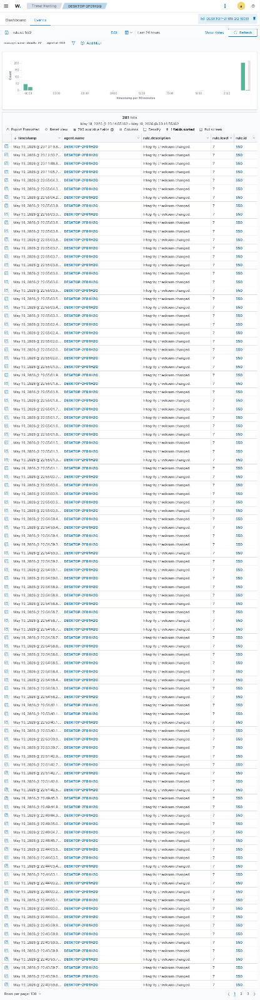

# Attack 06 — Registry Run Key Persistence

## Overview
| Field | Details |
|-------|---------|
| MITRE ID | T1547.001 |
| Tactic | Persistence |
| Severity | Critical |
| Tool | reg.exe (built-in Windows) |
| Wazuh Rule | 92302 — Level 6 |
| Log Source | Sysmon EID 13 (Registry Value Set) |
| Target | Windows 10 VM (192.168.56.105) |

## Objective
Simulate an attacker establishing persistence by adding a malicious entry to the Windows Registry Run key — ensuring the payload executes on every user login. This is one of the most common persistence mechanisms observed in real-world intrusions.

## Pre-requisites
- Wazuh agent running on Windows VM
- Sysmon configured with EID 13 (RegistryEvent) capturing CurrentVersion\Run keys
- Live monitor running on Ubuntu VM

## Execution Steps

### Step 1 — Start Live Monitor on Ubuntu VM
```bash
tail -f /var/ossec/logs/alerts/alerts.log | grep -i "92302\|100007\|CurrentVersion\|Run"
```

### Step 2 — Add Malicious Registry Run Key
On **Windows VM PowerShell as Administrator**:
```powershell
# Add malicious entry to registry Run key
reg add "HKCU\Software\Microsoft\Windows\CurrentVersion\Run" /v "SecurityUpdate" /t REG_SZ /d "C:\SOC-Lab\update.exe" /f

# Verify entry was added
reg query "HKCU\Software\Microsoft\Windows\CurrentVersion\Run"

# Verify Sysmon EID 13 logged it
Get-WinEvent -LogName "Microsoft-Windows-Sysmon/Operational" | Where-Object {$_.Id -eq 13} | Select-Object -First 3 | Format-List TimeCreated, Message
```

### Step 3 — Verify Alert in Wazuh Dashboard
```
Security Events → Search: SecurityUpdate
OR Filter: rule.id: 92302
```

### Step 4 — Cleanup
```powershell
reg delete "HKCU\Software\Microsoft\Windows\CurrentVersion\Run" /v "SecurityUpdate" /f
```

## Expected Output
```
Rule: 92302 (level 6) -> 'Registry entry to be executed on next logon
was modified using command line application reg.exe'
TargetObject: HKU\...\CurrentVersion\Run\SecurityUpdate
Details: C:\SOC-Lab\update.exe
Image: C:\Windows\system32\reg.exe
```

## Detection Details
| Field | Value |
|-------|-------|
| Rule ID | 92302 |
| Alert Level | 6 |
| Sysmon EID | 13 (Registry Value Set) |
| Event Type | SetValue |
| Target Key | HKCU\...\CurrentVersion\Run |
| Dashboard Search | SecurityUpdate OR CurrentVersion\Run |

## Attack Timeline
| Time | Event |
|------|-------|
| T+00:00 | reg.exe executed (Sysmon EID 1) |
| T+00:01 | Registry Run key value set (Sysmon EID 13) |
| T+00:01 | Rule 92302 fires — persistence detected |
| T+00:02 | Entry confirmed — survives reboot |

## Screenshots


