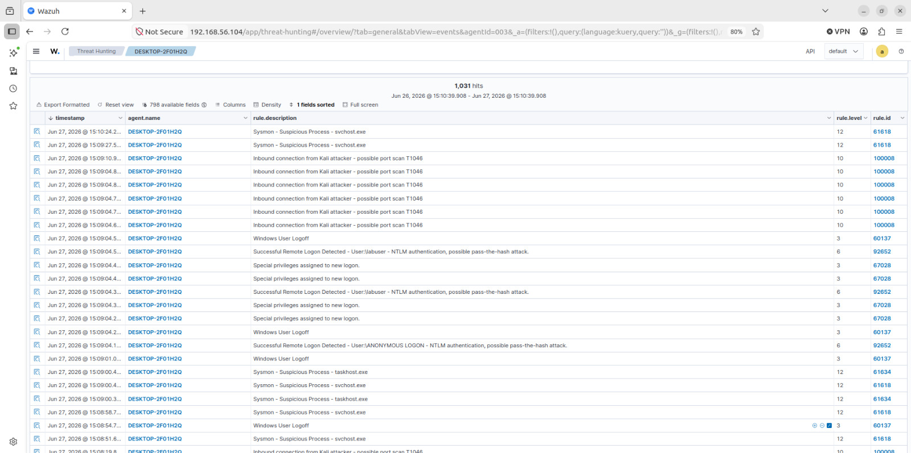
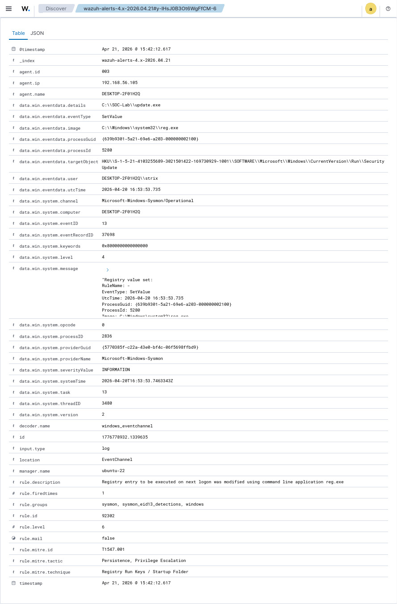

# Attack 07 — Network Port Scanning

## Overview
| Field | Details |
|-------|---------|
| MITRE ID | T1046 |
| Tactic | Discovery |
| Severity | Medium |
| Tool | Nmap |
| Wazuh Rule | 100008 — Level 10 |
| Log Source | Sysmon EID 3 (Network Connection) |
| Attacker | Kali Linux (192.168.56.106) |
| Target | Windows 10 VM (192.168.56.105) |

## Objective
Simulate network reconnaissance by scanning the Windows VM from Kali Linux. Port scanning is always the first step in a real attack — discovering open services before exploiting them. Detecting reconnaissance gives defenders early warning before the actual attack begins.

## Pre-requisites
- Kali Linux VM running and on Host-Only network
- Windows firewall logging enabled
- Rule 100008 loaded in local_rules.xml

## Execution Steps

### Step 1 — Enable Firewall Logging on Windows VM
```powershell
netsh advfirewall set allprofiles logging droppedconnections enable
netsh advfirewall set allprofiles logging allowedconnections enable
netsh advfirewall set allprofiles logging filename "C:\Windows\System32\LogFiles\Firewall\pfirewall.log"
Restart-Service WazuhSvc
```

### Step 2 — Start Live Monitor on Ubuntu VM
```bash
tail -f /var/ossec/logs/alerts/alerts.log | grep -i "100008\|port scan\|192.168.56.106"
```

### Step 3 — Execute Scan from Kali
```bash
# Basic SYN scan
nmap -sS -sV 192.168.56.105

# Aggressive scan — louder and more detectable
nmap -A -T4 192.168.56.105

# Full port scan
nmap -p- -T4 192.168.56.105
```

### Step 4 — Verify Alert in Dashboard
```
Security Events → Search: 192.168.56.106
OR Filter: rule.id: 100008
```

## Expected Output on Kali
```
Starting Nmap scan...
PORT     STATE SERVICE
135/tcp  open  msrpc
139/tcp  open  netbios-ssn
445/tcp  open  microsoft-ds
OS: Windows 10
```

## Expected Alert
```
Rule: 100008 (level 10)
Inbound connection from Kali attacker - possible port scan T1046
win.eventdata.sourceIp: 192.168.56.106
win.eventdata.initiated: false
```

## Detection Details
| Field | Value |
|-------|-------|
| Rule ID | 100008 |
| Alert Level | 10 |
| Sysmon EID | 3 (Network Connection) |
| Source IP | 192.168.56.106 (Kali) |
| Dashboard Search | 192.168.56.106 OR port scan |
| Total Hits | 1,031 |

## Attack Timeline
| Time | Event |
|------|-------|
| T+00:00 | SYN packets begin from 192.168.56.106 |
| T+00:01 | Multiple ports probed in rapid succession |
| T+00:02 | Sysmon EID 3 logs inbound connections |
| T+00:03 | Rule 100008 fires — 1,031 total hits |

## Screenshots


