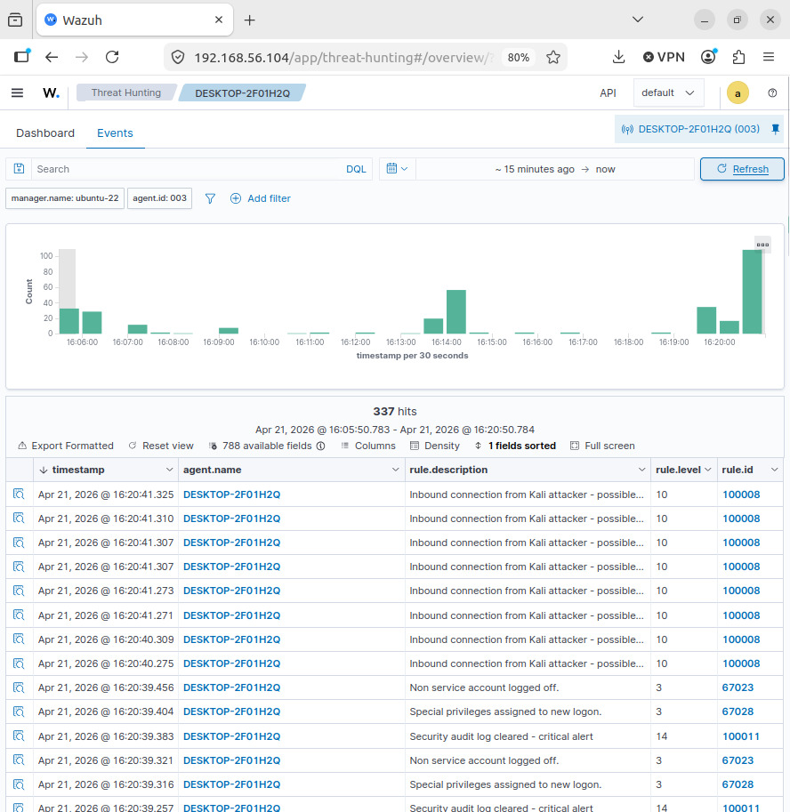
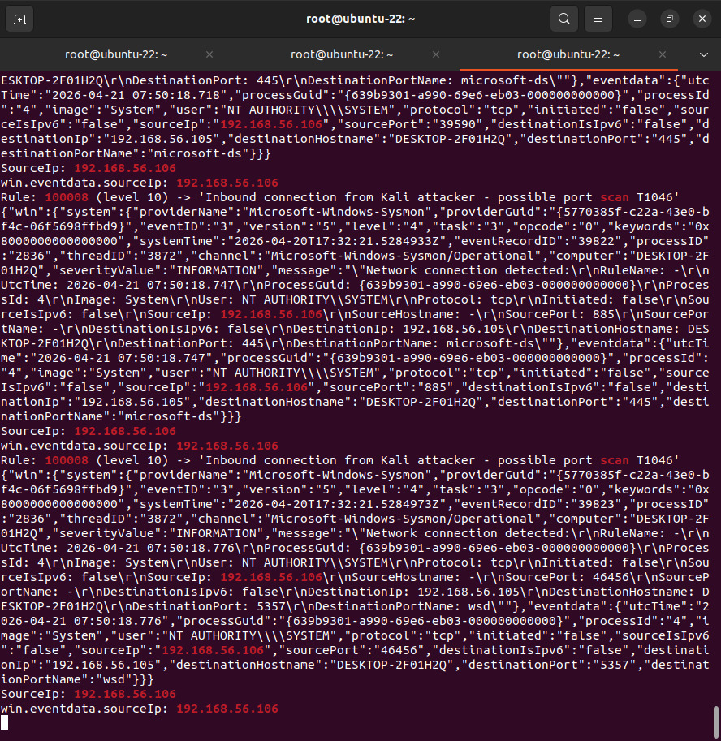

# Attack 08 — File Integrity Violation

## Overview
| Field | Details |
|-------|---------|
| MITRE ID | T1565.001 |
| Tactic | Impact |
| Severity | High |
| Tool | Wazuh FIM (File Integrity Monitoring) |
| Wazuh Rule | 550 (modified), 554 (new file) — Level 7 |
| Log Source | Wazuh syscheck module |
| Target | Windows 10 VM (192.168.56.105) |

## Objective
Simulate an attacker modifying sensitive configuration files after gaining access. Wazuh's FIM detects changes in real time using SHA256 hash comparison — proving that even subtle file modifications are caught immediately by a properly configured SIEM.

## Pre-requisites
- FIM configured in ossec.conf with realtime monitoring on C:\Temp
- Agent restarted to build FIM baseline
- 3 minute wait for baseline scan to complete

## Execution Steps

### Step 1 — Verify FIM Config in ossec.conf
Ensure this block exists in `C:\Program Files (x86)\ossec-agent\ossec.conf`:
```xml
<syscheck>
  <disabled>no</disabled>
  <frequency>180</frequency>
  <scan_on_start>yes</scan_on_start>
  <directories check_all="yes" realtime="yes">C:\Temp</directories>
  <directories check_all="yes" realtime="yes">C:\SOC-Lab</directories>
</syscheck>
```

### Step 2 — Start Live Monitor on Ubuntu VM
```bash
tail -f /var/ossec/logs/alerts/alerts.log | grep -i "550\|554\|syscheck\|config.txt"
```

### Step 3 — Build FIM Baseline
```powershell
# Restart agent to trigger baseline scan
Restart-Service WazuhSvc

# Wait 3 minutes for baseline to complete
Start-Sleep -Seconds 180
Write-Host "Baseline complete"
```

### Step 4 — Create Sensitive File (triggers Rule 554)
```powershell
mkdir C:\Temp -Force
echo "db_password=Admin123" > C:\Temp\config.txt
echo "api_key=sk-abc123xyz" >> C:\Temp\config.txt
```

### Step 5 — Tamper With File (triggers Rule 550)
```powershell
# Wait for FIM to detect new file
Start-Sleep -Seconds 15

# Tamper with file — hash mismatch triggers alert
echo "TAMPERED BY ATTACKER" >> C:\Temp\config.txt
```

### Step 6 — Verify Alert in Dashboard
```
Security Events → Search: syscheck
OR Search: config.txt
OR Filter: rule.id: 550
```

### Step 7 — Cleanup
```powershell
Remove-Item C:\Temp\config.txt -Force
```

## Expected Alerts
```
Rule: 554 (level 5) -> 'File added to monitored directory'
File: c:\temp\config.txt

Rule: 550 (level 7) -> 'Integrity checksum changed'
File: c:\temp\config.txt
Old MD5: a71bb6374de4d51d4913ed2ef67b9c6a
New MD5: e4132a01c3037984759996ca9c64d716d
syscheck.sha256_before: 1a3fe07dbe5f5ebde73cdfb4070abd6c...
syscheck.sha256_after:  8ce27fc9334c4783d84efe4ab3bf9850...
```

## Detection Details
| Field | Value |
|-------|-------|
| Rule 554 | New file added — Level 5 |
| Rule 550 | Hash mismatch — Level 7 |
| Mode | realtime |
| Changed Attributes | size, mtime, md5, sha1, sha256 |
| Total FIM Alerts | 281 |
| Dashboard Search | syscheck OR integrity checksum |

## Attack Timeline
| Time | Event |
|------|-------|
| T+00:00 | FIM baseline established |
| T+03:00 | config.txt created — Rule 554 fires |
| T+03:15 | config.txt tampered — hash mismatch |
| T+03:15 | Rule 550 fires — integrity violation |

## Key Finding
FIM detected the file modification within seconds and captured both the old and new SHA256 hashes — providing cryptographic proof of tampering. This demonstrates the value of real-time file integrity monitoring in a SOC environment.

## Screenshots



