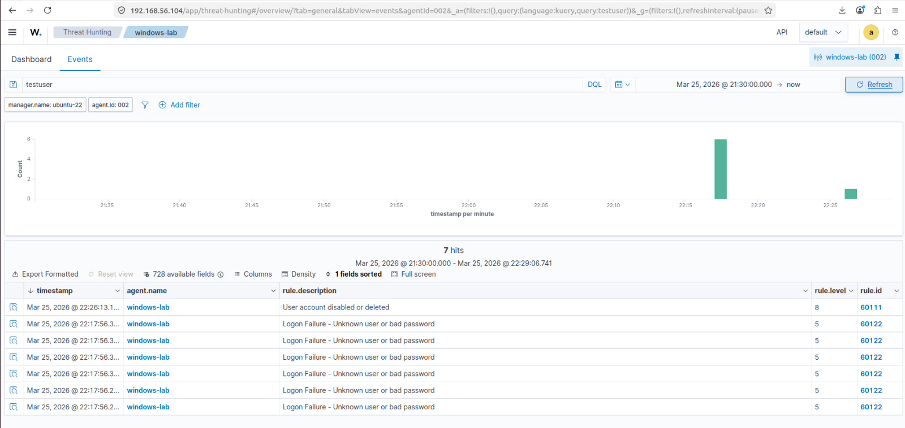

# Attack 09 — Local Account Discovery

## Overview
| Field | Details |
|-------|---------|
| MITRE ID | T1087.001 |
| Tactic | Discovery |
| Severity | Low |
| Tool | net.exe, PowerShell, CrackMapExec |
| Wazuh Rule | 100009 — Level 8 |
| Log Source | Sysmon EID 1 (Process Create) |
| Attacker | Kali Linux (192.168.56.106) |
| Target | Windows 10 VM (192.168.56.105) |

## Objective
Simulate post-exploitation account enumeration — a standard step after initial access where an attacker maps out users, groups, and privileges to plan lateral movement. Detecting enumeration activity gives defenders early warning of active intrusion.

## Pre-requisites
- Wazuh agent running on Windows VM
- Sysmon configured with EID 1 (Process Create)
- Rule 100009 loaded in local_rules.xml
- Live monitor running on Ubuntu VM

## Execution Steps

### Step 1 — Start Live Monitor on Ubuntu VM
```bash
tail -f /var/ossec/logs/alerts/alerts.log | grep -i "100009\|net user\|enumerat"
```

### Step 2 — Local Enumeration on Windows VM
```powershell
# Enumerate local users
net user

# Enumerate administrators group
net localgroup administrators

# PowerShell enumeration
Get-LocalUser | Select Name, Enabled, LastLogon
Get-LocalGroup

# Check current user privileges
whoami /all
```

### Step 3 — Remote Enumeration from Kali
```bash
# Enumerate users via SMB
crackmapexec smb 192.168.56.105 -u labuser -p Summer2024! --users

# Enumerate groups via SMB
crackmapexec smb 192.168.56.105 -u labuser -p Summer2024! --groups
```

### Step 4 — Verify Alert in Wazuh Dashboard
```
Security Events → Search: net user
OR Filter: rule.id: 100009
```

## Expected Output

### Windows VM
```
User accounts for \\DESKTOP-2F01H2Q
Administrator    labuser    strix
```

### Kali
```
SMB  192.168.56.105  445  DESKTOP-2F01H2Q  [+] labuser:Summer2024!
SMB  192.168.56.105  445  DESKTOP-2F01H2Q  [*] Trying with SAMRPC protocol
```

### Wazuh Alert
```
Rule: 100009 (level 8) -> 'Local account enumeration detected T1087.001'
win.eventdata.commandLine: net user
win.eventdata.image: C:\Windows\System32\net.exe
```

## Detection Details
| Field | Value |
|-------|-------|
| Rule ID | 100009 |
| Alert Level | 8 |
| Sysmon EID | 1 (Process Create) |
| Pattern | net\.exe.*(user\|localgroup) |
| Dashboard Search | net user OR Get-LocalUser |

## Attack Timeline
| Time | Event |
|------|-------|
| T+00:00 | net.exe spawned — user enumeration begins |
| T+00:01 | Sysmon EID 1 logs net.exe process creation |
| T+00:02 | Rule 100009 fires — enumeration detected |
| T+00:03 | Remote CrackMapExec enumeration also detected |

## Screenshots

