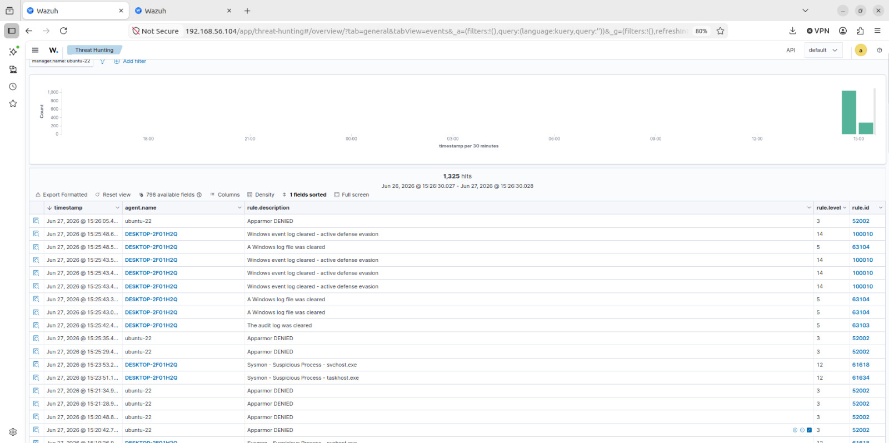

# Attack 10 — Event Log Clearing

## Overview
| Field | Details |
|-------|---------|
| MITRE ID | T1070.001 |
| Tactic | Defense Evasion |
| Severity | Critical |
| Tool | wevtutil.exe (built-in Windows) |
| Wazuh Rule | 100010 — Level 14 |
| Log Source | Windows Security EID 1102, System EID 104 |
| Target | Windows 10 VM (192.168.56.105) |

## Objective
Simulate an attacker attempting to destroy forensic evidence by clearing Windows event logs. This is one of the strongest indicators that an attacker is covering their tracks. The most critical finding: **Wazuh already forwarded all logs to the SIEM — the attacker's attempt to destroy evidence fails.**

## Pre-requisites
- Wazuh agent running on Windows VM
- Rules 100010 and 100011 loaded in local_rules.xml
- Live monitor running on Ubuntu VM

## Execution Steps

### Step 1 — Start Live Monitor on Ubuntu VM
```bash
tail -f /var/ossec/logs/alerts/alerts.log | grep -i "100010\|100011\|1102\|cleared\|wevtutil"
```

### Step 2 — Clear All Windows Event Logs
On **Windows VM PowerShell as Administrator**:
```powershell
# Clear Security event log — generates EID 1102
wevtutil cl Security

# Clear System log — generates EID 104
wevtutil cl System

# Clear Application log
wevtutil cl Application

# Clear PowerShell log
wevtutil cl "Windows PowerShell"

# Verify logs are cleared
wevtutil gli Security
```

### Step 3 — Verify Alert in Wazuh Dashboard
```
Security Events → Search: wevtutil
OR Search: 1102
OR Filter: rule.id: 100010
```

## Expected Output

### Windows VM
```
# Each wevtutil cl command produces no output (success)
# wevtutil gli Security shows:
numberOfLogRecords: 0    ← Confirms log cleared
```

### Wazuh OVA Live Monitor
```
Rule: 100010 (level 14) -> 'Windows event log cleared - active defense evasion'
win.eventdata.commandLine: wevtutil cl Security

Rule: 100011 (level 14) -> 'Security audit log cleared - critical alert'
win.system.eventID: 1102

Rule: 63104 (level 5) -> 'A Windows log file was cleared'
Rule: 63103 (level 5) -> 'The audit log was cleared'
```

## Detection Details
| Field | Value |
|-------|-------|
| Rule 100010 | Level 14 — wevtutil pattern match |
| Rule 100011 | Level 14 — EID 1102 Security log cleared |
| Rule 63103 | Level 5 — Audit log cleared |
| Rule 63104 | Level 5 — Windows log file cleared |
| Dashboard Search | wevtutil OR 1102 OR log cleared |

## Attack Timeline
| Time | Event |
|------|-------|
| T+00:00 | wevtutil.exe executed (Sysmon EID 1) |
| T+00:01 | Security log cleared — EID 1102 generated |
| T+00:01 | Rule 100010 fires — Level 14 Critical |
| T+00:02 | System + Application logs cleared |
| T+00:02 | Additional Level 14 alerts fire |
| T+00:03 | All local Windows logs destroyed |
| T+00:03 | SIEM copy fully intact — evidence preserved |

## Critical Finding
Even after clearing all Windows event logs, **every alert remained preserved in Wazuh**. The attacker destroyed local evidence but the SIEM had already forwarded and indexed all events. This single test proves the core value proposition of centralized logging:

```
✅ Local Windows logs: DESTROYED by attacker
✅ Wazuh SIEM copy:   FULLY INTACT
✅ All 10 attack alerts: PRESERVED and searchable
```

The SIEM is the last line of forensic defense.

## IR Considerations
- Log clearing is a confirmed breach indicator — treat as active incident
- Isolate host immediately before attacker pivots
- All previous attack evidence still available in Wazuh
- Memory dump before shutdown — volatile evidence preservation

## Screenshots

